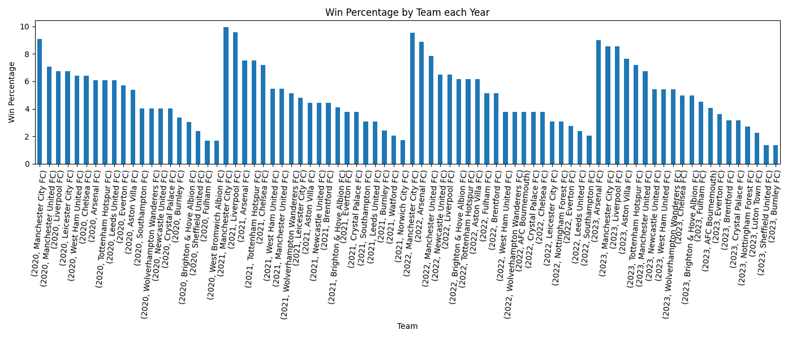

# football
API:

API initial Url: https://api.football-data.org/

API account name: testing.data999@gmail.com

API token information:

- Please modify your client to use a HTTP header named "X-Auth-Token" with the underneath personal token as value. Your token: 12abfbaacdab48bc8948ed6061925e1f


----------------------------------------------------------------

# Python Running Instructions

## Environment Setup

1. **Create a new Conda environment:**
    ```bash
    conda create --name amin_testenv python=3.8
    ```

2. **Activate the newly created environment:**
    ```bash
    conda activate amin_testenv
    ```

3. **Install dependencies:**
    Install pip 
    ```bash
    conda install pip
    ```
    Then you can use `requirements.txt` with pip:
    ```bash
    pip install -r requirements.txt
    ```
    - Alternatively, you can use  `environment.yml` with conda:
    ```bash
    conda env update --file environment.yml
    ```

   

## API Version

This code utilizes version 4 of the API.

## Code structure

```
project/
│
├── images/
│   └── win_percenatge.png
├── tests/
│   └── test_data_handler.py
│
├── config.json
├── data_handler.py
├── environment.yml
├── main_test.py
├── main.py
├── performance_analysis.py
└── requirements.txt

```

## Running the Code

The `config.json` file contains settings such as the API token, CSV file names, and other configuration options, which can be edited as needed.

To run the code, execute the `main.py` file. It calls the `DataHandler` class, which interacts with the football API, extracts necessary features, and transforms them into a CSV file containing the required period.


generate csv file. The output will be stored as `epl_teams_performance.csv`.
```bash
python main.py --extract_csv 

```
To plot win percentage 

```bash
python main.py --plt_win_prct 
```
To plot home win
```bash
python main.py --plt_home_win 
```
To plot away win 
```bash
python main.py --plt_away_win 
```
    



## Key Performance Indicators (KPIs) and Visualization

The code includes functions to calculate various KPIs such as:

These Key Performance Indicators (KPIs) can be visualized as depicted below. Additional KPIs can be incorporated as per the request from the Business Intelligence (BI) team.


```bash
python main.py --plt_win_prct 
```

```bash
python main.py --plt_home_win 
```

```bash
python main.py --plt_away_win 
```


## Unit Testing

Unit tests are available in the `tests` folder. You can run them to ensure the code behaves as expected.


